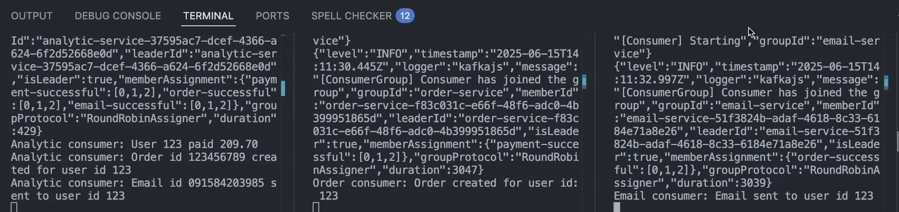
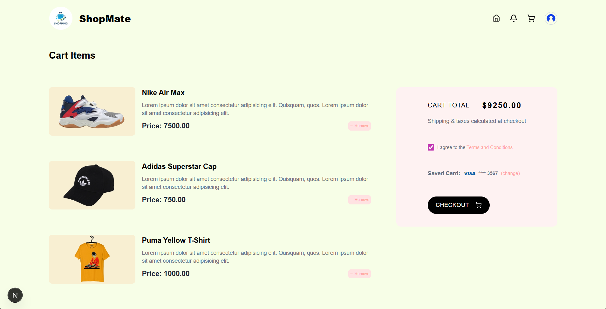

# 🛒 High-Performance E-Commerce Event Processing with Kafka, Express.js & Docker

This project demonstrates how to build a **high-throughput, low-latency microservices system** using **Kafka**, **Express.js**, and **Docker**.

The app processes **analytics**, **payments**, **order histories**, and **email notifications** for every item in the user’s cart — **all at once**, in parallel.  
Thanks to Kafka’s distributed event architecture, I reduced the overall response time from:

8 seconds ➝ 1 second ⚡

Huge improvement in speed, scalability, and reliability.

---

## Demo




## 🚀 What This Project Does

Whenever a user places an order, Kafka publishes events to different topics, and **multiple services consume them simultaneously**:

### ✔️ Analytics Service  
Tracks user events, order frequency, product popularity, and behavioral metrics in real time.

### ✔️ Payment Service  
Processes mock payments asynchronously without blocking the API.

### ✔️ Order History Service  
Writes the final order details to a database for future retrieval.

### ✔️ Email Notification Service  
Sends confirmation emails for each purchased product.

All these tasks happen **concurrently** — not sequentially — resulting in a dramatic performance boost.

---


Each microservice is isolated, scalable, and stateless — exactly how event-driven systems should be.

---

## 🛠 Tech Stack

### **Backend**
- Node.js / Express.js  
- KafkaJS (Kafka client for Node.js)

### **Infrastructure**
- Kafka (Multi-broker)  
- Zookeeper  
- Docker & Docker Compose  
- Bridge networking

### **Additional Tools**
- Winston Logger  
- Postman / Thunderclient  

---


Each service is fully isolated and runs in its own container.

---

## ⚙️ Running the Project

### **1️⃣ Clone the repository**
bash
```

git clone https://github.com/<your-username>/<your-repo>.git
cd <your-repo>
docker compose up --build
POST http://localhost:3000/order

#For generating logs of different services
docker logs -f analytics-service
docker logs -f payment-service
docker logs -f email-service
docker logs -f order-history-service

```
### **1️⃣ Example data**

```
{
  "userId": 42,
  "products": [
    { "id": 1, "name": "Keyboard", "price": 999 },
    { "id": 2, "name": "Mouse", "price": 499 }
  ]
}
```


## **Performance Improvements**


- Kafka handles event distribution, so slow tasks no longer block the API.

## **Why Kafka**
- High throughput

- Parallel processing

- Loose coupling between services

- Reliable asynchronous messaging

- Easy horizontal scaling

- Real-world event-driven architecture (used by Uber, Netflix, PayPal)

- This project simulates a real production-style event streaming system.


                
